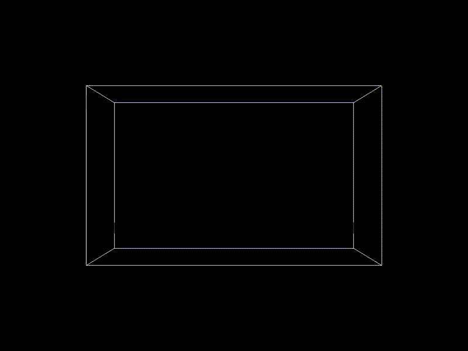
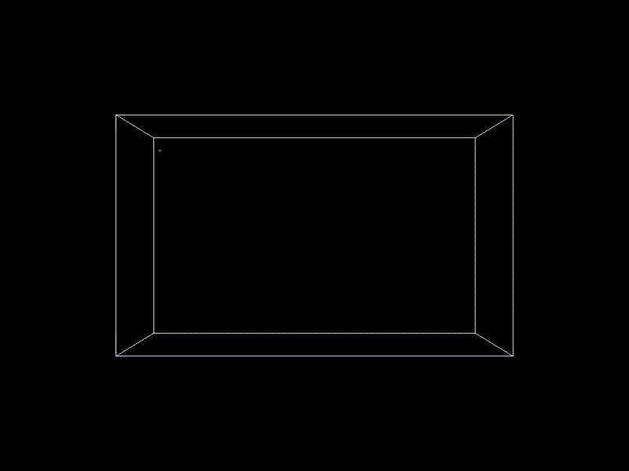

# Deep Water Impact Dataset (LA-UR-17-21595)

[](https://creativecommons.org/licenses/by/4.0/)

```
XX              XXXXX XXX         XX XX           XX       XX XX XXX         XXX
XX             XXX XX XXXX        XX XX           XX       XX XX    XX     XX   XX
XX            XX   XX XX XX       XX XX           XX       XX XX      XX XX       XX
XX           XX    XX XX  XX      XX XX           XX       XX XX      XX XX       XX
XX          XX     XX XX   XX     XX XX           XX XXXXX XX XX      XX XX       XX
XX         XX      XX XX    XX    XX XX           XX       XX XX     XX  XX
XX        XX       XX XX     XX   XX XX           XX       XX XX    XX   XX
XX       XX XX XX XXX XX      XX  XX XX           XX XXXXX XX XX XXX     XX       XX
XX      XX         XX XX       XX XX XX           XX       XX XX         XX       XX
XX     XX          XX XX        X XX XX           XX       XX XX         XX       XX
XX    XX           XX XX          XX XX           XX       XX XX          XX     XX
XXXX XX            XX XX          XX XXXXXXXXXX   XX       XX XX            XXXXXX
```

This [sample dataset](data) is generated by converting an existing LANL deep water asteroid impact dataset (released under LA-UR-17-21595) from its original VTK format into parquet. There are 64 equally-formatted parquet files in this dataset. Each stores the state of a specific simulation timestep, from timestep 0 to timestep 49978. All files consist of a single row group of 27,000,000 rows and 3 columns: `rowid`, `v02`, and `v03`. All files were brotli compressed before uploading to github.

To recover a parquet file from its brotli compressed form:

```bash
brotli -d <parquet_file>.br
```

For example:

```bash
brotli -d pv_insitu_300x300x300_00000.parquet.br
```

On Ubuntu, brotli can be installed through APT:

```bash
sudo apt-get install brotli
```

# Schema and Statistics

See below for a quick metadata dump for one of the parquet files: `pv_insitu_300x300x300_00000.parquet`.

```
File path:  pv_insitu_300x300x300_00000.parquet
Created by: parquet-cpp-arrow version 16.1.0
Properties:
     origin_0: -2300000.000000
     extent_4: 0
     extent_3: 299
     origin_1: -500000.000000
     extent_2: 0
     origin_2: -1200000.000000
     extent_1: 299
     extent_0: 0
  cycle_index: 0
     extent_5: 299
    spacing_0: 15384.615385
    spacing_1: 9364.548495
    spacing_2: 8026.755853
Schema:
message schema {
  required int32 rowid (INTEGER(32,true));
  required float v02;
  required float v03;
}


Row group 0:  count: 27000000  8.00 B records  start: 4  total(compressed): 206.051 MB total(uncompressed):207.010 MB 
--------------------------------------------------------------------------------
       type      encodings count     avg size   nulls   min / max
rowid  INT32     S   D     27000000  0.00 B     0       "0" / "26999999"
v02    FLOAT     _   _     27000000  4.00 B     0       "-0.0" / "1.0"
v03    FLOAT     _   _     27000000  4.00 B     0       "-0.0" / "0.988359"

```

# Sample Movies

| v02 (water) | v03 (asteroid) |
| :---: | :---: |
|  |  |

# Acknowledgement

The deep water asteroid impact dataset represents the study of asteroid impacts in deep ocean water. NASA’s Planetary Defense Coordination Office is keenly interested to know the lower size limit of dangerous asteroids, so as to focus resources on finding all larger objects that potentially threaten the earth. Since most of the planet’s surface is water, that is where asteroids will most likely impact. This observation has generated a serious debate over the last two decades on just how dangerous impact-induced waves or tsunamis are to populated shorelines. Check their [paper](https://datascience.dsscale.org/wp-content/uploads/2017/08/VisualizationAndAnalysisOfThreatsFromAsteroidOceanImpacts.pdf) and the [video](https://www.youtube.com/watch?v=yeXcgnj8AG0) for more information regarding this fun dataset.

[DuckDB](https://duckdb.org/) is an open source high-performance analytical database system.

This sample dataset is prepared by an employee of Triad National Security, LLC which operates Los Alamos National Laboratory for the U.S. Department of Energy/National Nuclear Security Administration.

